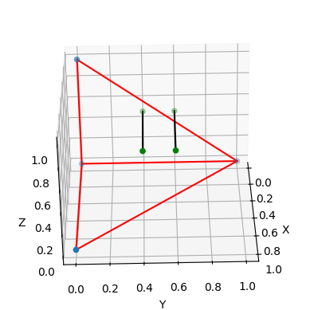

# py_geometry_constraint

The [geometryConstraint](https://download.autodesk.com/global/docs/maya2012/zh-cn/CommandsPython/geometryConstraint.html) function in Maya and similar functions in other languages are helpful to project points/vertices onto a mesh, locking their motion.

But I have found no similar implementations currently existing in python.
After some research, referencing to:

1. https://github.com/facebookresearch/pytorch3d/issues/193 and
2. https://github.com/facebookresearch/pytorch3d/issues/1016

I present to you a geometryConstraint implementation in python, using pytorch3d.

Example output:

- blue points: vertices on mesh
- red lines: edges on mesh
- green points: points and their projection on the closest plane/faces
- black lines: line of projection

## Development Environment

WSL Ubuntu-22.04 with python3.10